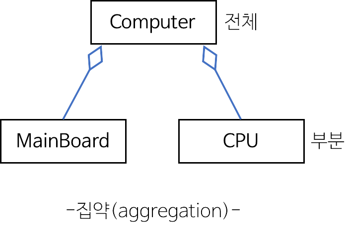
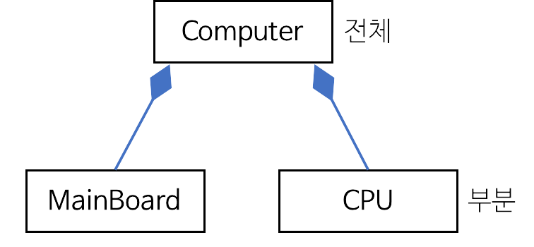

### 1. UML 개요
개발자와 고객 또는 개발자 사이 의사소통이 원활하게 이루어지도록 표준화한 대표적인 객체지향 모델링 언어
- UML은 Rumbaugh, Booch, Jacobson 등의 객체지향 방법론의 장점을 통합하고, 객체 기술에 관한 국제 표준화 기구인 OMG(Object Management Group)에서 표준으로 지정함
- UML을 이용하여 시스템의 구조를 표현하는 <span style="background-color:yellow">6개의 구조 다이어그램</span>과 시스템의 동작을 표현하는 <span style="background-color:yellow">7개의 행위 다이어그램</span>을 작성할 수 있다.
- UML 구성 요소는 **사물**, **관계**, **다이어그램**이 있다.

### 2. 사물
모델을 구성하는 가장 중요한 기본 요소로, 다이어그램 안에서 관계가 형성될 수 있는 대상들을 말함
1) 구조사물
    - 시스템의 개념적, 물리적 요소 표현
    - 클래스, 유스케이스, *컴포넌트, 노드
    *컴포넌트: 문서, 소스코드, 파일, 라이브러리 등과 같은 자원으로, 재사용이 가능*
2) 행동사물
    - 시간과 공간에 따른 요소들의 행위 표현
    - 상호작용, 상태머신 등
3) 그룹 사물
    - 요소들을 그룹으로 묶어서 표현
    - 패키지
4) 주해 사물
    - 부가적인 설명이나 제약조건을 표현
    - 노트

### 3. 관계
사물과 사물 사이 연관성을 표현하는 것
1) 연관 관계: 2개 이상의 사물이 서로 관련되어 있음을 표현
    - 사물 사이를 **실선**으로 연결하여 표현하며, 방향성은 **화살표**로 표현
    - 서로에게 영향을 주는 양방향 관계의 경우 화살표를 생략하고 실선으로만 연결
    - 연관에 참여하는 객체의 개수를 의미하는 다중도를 선 위에 표기
    
    |다중도|의미|
    |---|---|
    |1|1개의 객체가 연관되어 있다|
    |n|n개의 객체가 연관되어 있다|
    |0..1|연관된 객체가 없거나 1개만 존재한다|
    |0..* 또는 *|연관된 객체가 없거나 다수일 수 있다|
    |1..*|연관된 객체가 적어도 1개 이상이다|
    |n..*|연관된 객체가 적어도 n개 이상이다|
    |n..m|연관된 객체가 최소 n개에서 최대 m개이다|
    
    ex 1) 사람이 집을 소유하는 관계
    ```mermaid
        flowchart LR
        A[사람]
        B[집]
        A-->|1| B
    ```
    ex 2) 선생님은 학생을 가르치고 학생은 선생님에게 가르침을 받는 관계
    ```mermaid
        flowchart LR
        A[선생님]
        B[학생]
        A --- |1..*| B
    ```

2) 집합 관계: 하나의 사물이 다른 사물에 포함되어 있는 관계
    - 포함하는 쪽(Whole)과 포함되는 쪽(Part)은 서로 독립적이다
    - 포함되는 쪽(Part)에서 포함하는 쪽(Whole)로 속이 빈 마름모를 연결하여 표현

    ex) 프린터는 컴퓨터에 연결하여 사용할 수 있고, 다른 컴퓨터에 연결해서 사용할 수도 있다.
    

3) 포함 관계: 포함하는 사물의 변화가 포함되는 사물에게 영향을 미치는 관계
    - 포함하는 쪽과 포함되는 쪽은 서로 독립될 수 없고 생명주기를 함께한다
    - 포함되는 쪽에서 포함하는 쪽으로 속이 채워진 마름모를 연결하여 표현한다

    ex) 문을 열수 있는 키는 하나이며, 해당 키로 다른 문은 열 수 없다. 문이 없어지면 키도 필요하지 않다.
    

4) 일반화 관계: 하나의 사물이 다른 사물에 비해 더 일반적인지 구체적인지 표현
    - 일반적인 개념을 상위(부모), 구체적인 개념을 하위(자식)
    - 구체적(하위)에서 일반적(상위)인 쪽으로 속이 빈 화살표 연결

    ex) 아메리카노와 에스프레소는 커피이다.
    ```mermaid
        flowchart BT
        A[에스프레소]
        B[아메리카노]
        C[커피]
        A --> C
        B --> C
    ```

5) 의존 관계: 서로 연관은 있으나 서로에게 영향을 주는 짧은 시간 동안만 연관을 우지하는 관계
    - 소유 관계는 아니지만 사물의 변화가 다른 사물에도 영향을 미치는 관계
    - 영향을 주는 사물이 영향을 받는 사물 쪽으로 점선 화살표 연결

    ex) 등급이 높으면 할인율을 적용하고, 낮으면 할인율을 적용하지 않는다
    ```mermaid
        flowchart LR
        A[등급]
        B[할인율]
        A -.-> B
    ```

6) 실체화 관계: 사물이 할 수 있거나 해야하는 기능으로 서로를 그룹화
    - 사물에서 기능 쪽으로 속이 빈 점선으로 연결
    ```mermaid
        flowchart BT
        A[비행기]
        B[새]
        C[날 수 있는]
        A -.-> C
        B -.-> C
    ```

### 4. 다이어그램
사물과 관계를 도형으로 표현한 것
- 정적모델링은 구조적 다이어그램, 동적모델링은 행위다이어그램
- 구조적 다이어그램 종류(클객컴배복패)
    - 클래스 다이어그램
        - 클래스와 클래스가 가지는 속성, 클래스 사이의 관계를 표현
        - 시스템 구조 파악과 구조상 문제점 도출 가능
    - 객체 다이어그램
        - 클래스에 속한 사물들, 인스턴스를 특정 시점의 객체와 객체 사이의 관계로 표현
        - **럼바우** 객체지향 분석기법에서 **객체 모델링**에 활용
    - 컴포넌트 다이어그램
        - 컴포넌트간의 관계나 컴포넌트 간 인터페이스 표현
        - 구현단계에서 사용
    - 배치 다이어그램
        - 결과물, 프로세스, 컴포넌트 등 물리적 요소들의 위치 표현
        - 구현단계에서 사용
    - 복합체 구조 다이어그램
        - 클래스나 컴포넌트가 복합구조를 갖는 경우 그 내부구조를 표현
    - 패키지 다이어그램
        - 유스케이스나 클래스 등의 모델 요소들을 그룹화한 패키지들의 관계

- 행위 다이어그램 종류(유시커상활상타)
    - 유스케이스 다이어그램
        - 사용자의 요구를 분석하는 것으로 **기능 모델링**에서 사용
        - 사용자(액터)와 사용사례(유스케이스)로 구성
    - 시퀀스 다이어그램
        - 상호작용하느 시스템이나 객체들이 주고받는 메세지 표현
    - 커뮤니케이션 다이어그램
        - 시퀀스 다이어그램과 같이 동작에 참여하는 객체들이 주고받는 메세지 뿐만 아니라 객체 간 연관까지 표현
    - 상태 다이어그램
        - 하나의 객체가 자신이 속한 클래스의 상태변화 혹은 다른 개게와의 상호작용에 따라 상태가 어떻게 변화하는지 표현
        - **럼바우** 객체 모델링에서 **동적모델링**에 활용
    - 활동 다이어그램
        - 시스템이 어떤 기능을 수행하는지 객체의 처리 로직나 조건에 따른 처리의 흐름을 순서에 따라 표현
    - 상호작용 개요 다이어그램
        - 상호작용 다이어그램 간 제어흐름 표현
    - 타이밍 다이어그램
        - 객체 상태변화와 시간 제약을 명시적으로 표현